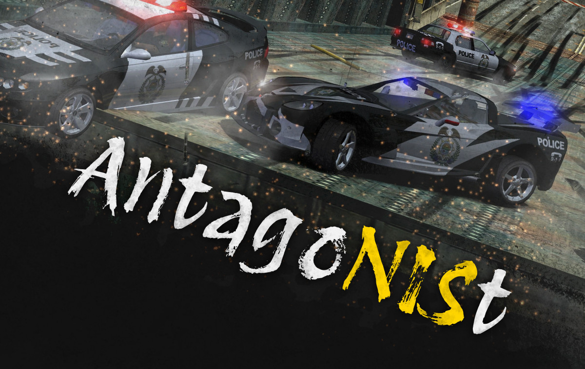

AntagoNISt lets you **change background vehicles** in *Need for Speed: Most Wanted* (2005) NIS cutscenes.

&nbsp;

The **sections below** address these questions in detail:
1. [How do I install AntagoNISt for my game?](#1---how-do-i-install-antagonist-for-my-game)
2. [Which mods are (in)compatible with AntagoNISt?](#2---which-mods-are-incompatible-with-antagonist)
3. [How may I share or bundle AntagoNISt?](#3---how-may-i-share-or-bundle-antagonist)

&nbsp;

&nbsp;

&nbsp;

# 1 - How do I install AntagoNISt for my game?

**Before installing** AntagoNISt:
1. read and understand the section about [mod (in)compatibilities](#2---which-mods-are-incompatible-with-antagonist) below,
2. make sure your cracked copy of the game isn't a repack or came pre-modified in any way,
3. make sure your game's `speed.exe` is compatible (i.e. 5.75 MB / 6,029,312 bytes large), and
4. install an `.asi` loader or any mod with one (e.g. the [WideScreenFix](https://github.com/ThirteenAG/WidescreenFixesPack/releases/tag/nfsmw) mod by ThirteenAG).

&nbsp;

**To install** AntagoNISt:
1. download and extract the [`NfSMW_AntagoNISt_v1.00.1.7z`](https://github.com/rng-guy/NFSMWAntagoNISt/releases/latest) archive;
2. copy AntagoNISt's `scripts` folder to your game's folder, replacing existing files; and
3. if AntagoNISt's `.asi` file gets flagged by your antivirus software, whitelist the file.

&nbsp;

**After installing** AntagoNISt, edit its `NFSMWAntagoNIStSettings.ini` file to your liking.

**To uninstall** AntagoNISt, remove its files from your game's `scripts` folder.

**To update** AntagoNISt, uninstall it and repeat the installation process above.

&nbsp;

&nbsp;

&nbsp;

# 2 - Which mods are (in)compatible with AntagoNISt?

All **[VltEd](https://nfs-tools.blogspot.com/2019/02/nfs-vlted-v46-released.html) and [Binary](https://github.com/SpeedReflect/Binary/releases) mods** should be fully compatible with AntagoNISt. 

Almost all  **other `.asi` mods** should be fully compatible with AntagoNISt.

&nbsp;

&nbsp;

&nbsp;

# 3 - How may I share or bundle AntagoNISt?

You are free to bundle AntagoNISt and its files with your own mod, **no credit required**. In the interest of code transparency, however, consider linking to [AntagoNISt's GitHub repository](https://github.com/rng-guy/NFSMWAntagoNISt) somewhere in your mod's documentation (e.g. README).